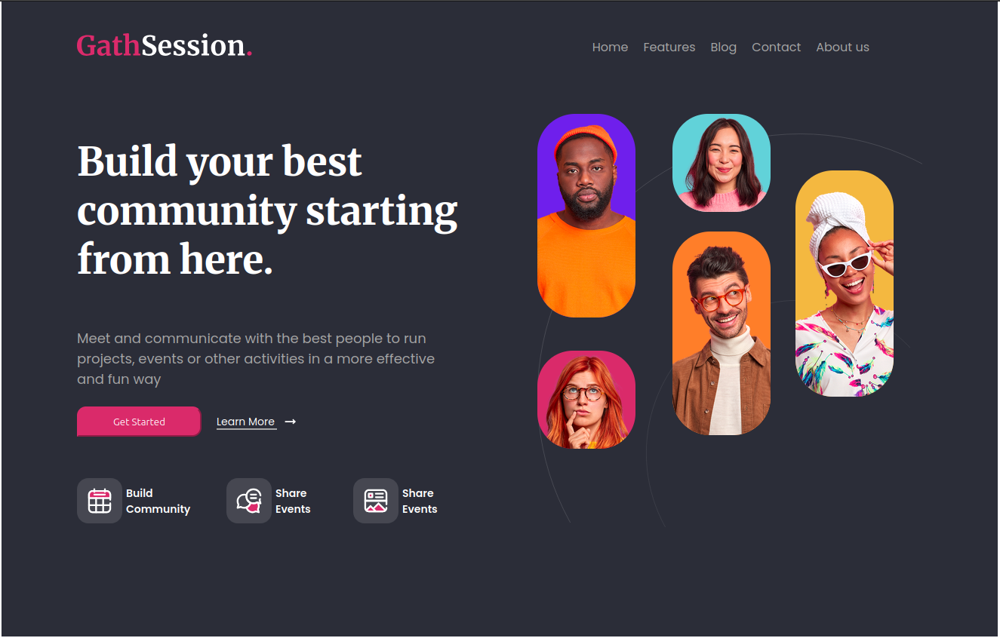

# Geth Session

## 📌 Descripción

Landing page desarrollada como práctica enfocada en maquetación moderna utilizando CSS Grid y Flexbox para la estructura del layout.

Se implementó la metodología BEM para mantener una arquitectura de estilos clara, escalable y reutilizable.

El proyecto utiliza Sass con una estructura modular (abstracts, components, layout) para mejorar la organización y mantenibilidad del código.

Además, se trabajó con pseudoelementos (::before y ::after) para agregar detalles visuales y mejorar la interacción sin sobrecargar el HTML.

El proyecto utiliza SASS para modularizar estilos y Vite como herramienta de desarrollo.

---

## 🎯 Objetivo
Practicar maquetación profesional, estructura de estilos y flujo de trabajo con herramientas modernas del frontend.

---

## 🚀 Tecnologías
- HTML
- CSS
- SASS
- Vite
- BEM

---

## 📸 Preview


---

## 🌐 Deploy
👉 (agregar link de Vercel acá)

---

## 📂 Estructura

El proyecto está organizado de forma modular para facilitar la escalabilidad y el mantenimiento del código:

- **/src**
  - `main.js`: punto de entrada de Vite
  - `/sass`: estilos organizados por responsabilidad
    - `/abstracts`: variables y mixins reutilizables
    - `/base`: estilos globales (reset, tipografía base)
    - `/components`: componentes reutilizables e independientes
    - `/layout`: estructura principal (header, hero, navbar)
    - `/pages`: estilos específicos de cada vista

- **/public**
  - `/img`: recursos estáticos como imágenes e íconos

## ⚙️ Instalación

```bash
npm install